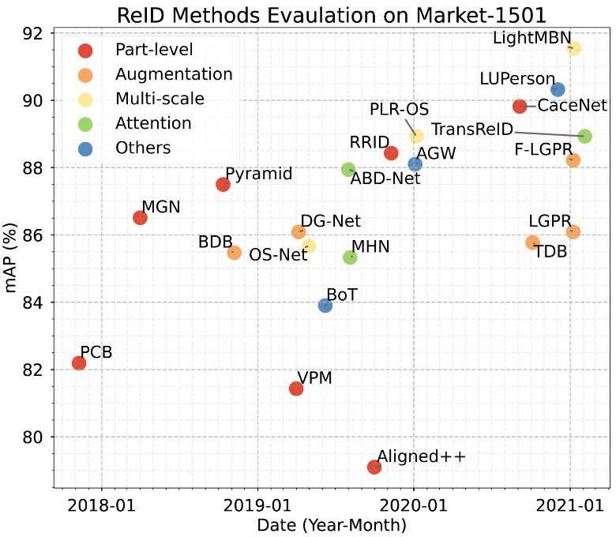

# Corruption Invariant Learning for Re-identification.


## Evaluating Corruption Robustness On-the-fly

#### Corruption Transform

The main code of corruption transform. (See contextual code in ./datasets/make_dataloader.py, line 61)

```python
from imagecorruptions.corruptions import *

corruption_function = [gaussian_noise, shot_noise, impulse_noise, defocus_blur,
    glass_blur, motion_blur, zoom_blur, snow, frost, fog, brightness, contrast,
    elastic_transform, pixelate, jpeg_compression, speckle_noise,
    gaussian_blur, spatter, saturate, rain]
    
class corruption_transform(object):
    def __init__(self, level=0, type='all'):
        self.level = level
        self.type = type

    def __call__(self, img):
        if self.level > 0 and self.level < 6:
            level_idx = self.level
        else:
            level_idx = random.choice(range(1, 6))
        if self.type == 'all':
            corrupt_func = random.choice(corruption_function)
        else:
            func_name_list = [f.__name__ for f in corruption_function]
            corrupt_idx = func_name_list.index(self.type)
            corrupt_func = corruption_function[corrupt_idx]
        c_img = corrupt_func(img.copy(), severity=level_idx)
        img = Image.fromarray(np.uint8(c_img))
        return img
```

Evaluating corruption robustness can be realized on-the-fly by modifing the transform function uesed in test dataloader. (See details in ./datasets/make_dataloader.py, Line 236)

```python
val_with_corruption_transforms = T.Compose([
    corruption_transform(0),
    T.Resize(cfg.INPUT.SIZE_TEST),
    T.ToTensor(),])
```

#### Rain details
We introduce a rain corruption type, which is a common type of weather condition, but it is missed by the original corruption benchmark. (See details in ./datasets/make_dataloader.py, Line 29)

```python
def rain(image, severity=1):
    if severity == 1:
        type = 'drizzle'
    elif severity == 2 or severity == 3:
        type = 'heavy'
    elif severity == 4 or severity == 5:
        type = 'torrential'
    blur_value = 2 + severity
    bright_value = -(0.05 + 0.05 * severity)
    rain = abm.Compose([
        abm.augmentations.transforms.RandomRain(rain_type=type, 
        blur_value=blur_value, brightness_coefficient=1, always_apply=True),
        abm.augmentations.transforms.RandomBrightness(limit=[bright_value, 
        bright_value], always_apply=True)])
    width, height = image.size
    if height <= 60:
        scale_factor = 65.0 / height
        new_size = (int(width * scale_factor), 65)
        image = image.resize(new_size)
    return rain(image=np.array(image))['image']
```


## Recent Advance in Person Re-ID

<table><tr>
<td>  </td>
<td>  </td>
</tr></table>


## Learderboard

#### Market1501-C 
**(Note: ranked by mAP on corrupted test set)**
<table>
    <tr>
        <th rowspan="2"> Method</th>
        <th rowspan="2"> Reference </th>
        <th colspan="3">Clean Eval.</th>
        <th colspan="3">Corruption Eval.</th>
    </tr>
    <tr>
        <th>mINP</th> <th>mAP</th> <th>Rank-1</th>
        <th>mINP</th> <th>mAP</th> <th>Rank-1</th>
    </tr>
    <tr>
        <td> TransReID </td> 
        <td> <a href="https://arxiv.org/abs/2102.04378"> Shuting He et al. (2021) </a> </td>
        <td> 69.29 </td> <td> 88.93 </td> <td> 95.07 </td>
        <td> 1.98 </td>  <td> <b>27.38</b> </td> <td> 53.19 </td>
    </tr>
    <tr>
        <td> CaceNet </td>
        <td> <a href="https://arxiv.org/abs/2009.05250"> Fufu Yu et al. (2020) </a> </td>
        <td> 70.47 </td> <td> 89.82 </td> <td> 95.40 </td>
        <td> 0.67 </td>  <td> <b>18.24</b> </td> <td> 42.92 </td>
    </tr>
    <tr>
        <td> LightMBN </td> 
        <td> <a href="https://arxiv.org/abs/2101.10774"> Fabian Herzog et al. (2021) </a> </td>
        <td> 73.29 </td> <td> 91.54 </td> <td> 96.53 </td>
        <td> 0.50 </td> <td> <b>14.84</b> </td> <td> 38.68 </td>
    </tr>
    <tr>
        <td> PLR-OS </td> 
        <td> <a href="https://arxiv.org/abs/2001.07442"> Ben Xie et al. (2020) </a> </td>
        <td> 66.42 </td> <td> 88.93 </td> <td> 95.19 </td>
        <td> 0.48 </td> <td> <b>14.23</b> </td> <td> 37.56 </td>
    </tr>
    <tr>
        <td> RRID </td> 
        <td> <a href="https://arxiv.org/abs/1911.09318"> Hyunjong Park et al. (2019) </a> </td>
        <td> 67.14 </td> <td> 88.43 </td> <td> 95.19 </td>
        <td> 0.46 </td> <td> <b>13.45</b> </td> <td> 36.57 </td>
    </tr>
    <tr>
        <td> Pyramid </td> 
        <td> <a href="https://arxiv.org/abs/1810.12193"> Feng Zheng et al. (2018) </a> </td>
        <td> 61.61 </td> <td> 87.50 </td> <td> 94.86 </td>
        <td> 0.36 </td> <td> <b>12.75</b> </td> <td> 35.72 </td>
    </tr>
    <tr>
        <td> PCB </td> 
        <td> <a href="https://arxiv.org/abs/1711.09349"> Yifan Sun et al.(2017) </a> </td>
        <td> 41.97 </td> <td> 82.19 </td> <td> 94.15 </td>
        <td> 0.41 </td>  <td> <b>12.72</b> </td> <td> 34.93 </td>
    </tr>
    <tr>
        <td> BDB </td> 
        <td> <a href="https://arxiv.org/abs/1811.07130"> Zuozhuo Dai et al. (2018) </a> </td>
        <td> 61.78 </td> <td> 85.47 </td> <td> 94.63 </td>
        <td> 0.32 </td> <td> <b>10.95</b> </td> <td> 33.79 </td>
    </tr>
    <tr>
        <td> Aligned++ </td> 
        <td> <a href="https://www.sciencedirect.com/science/article/abs/pii/S0031320319302031"> Hao Luo et al. (2019) </a> </td>
        <td> 47.31 </td> <td> 79.10 </td> <td> 91.83 </td>
        <td> 0.32 </td> <td> <b>10.95</b> </td> <td> 31.00 </td>
    </tr>
    <tr>
        <td> AGW </td> 
        <td> <a href="https://arxiv.org/abs/2001.04193v2"> Mang Ye et al. (2020) </a> </td>
        <td> 65.40 </td> <td> 88.10 </td> <td> 95.00 </td>
        <td> 0.30 </td> <td> <b>10.80</b> </td> <td> 33.40 </td>
    </tr>
    <tr>
        <td> MHN </td> 
        <td> <a href="https://arxiv.org/abs/1908.05819"> Binghui Chen et al. (2019) </a> </td>
        <td> 55.27 </td> <td> 85.33 </td> <td> 94.50 </td>
        <td> 0.38 </td> <td> <b>10.69</b> </td> <td> 33.29 </td>
    </tr>
    <tr>
        <td> LUPerson </td> 
        <td> <a href="https://arxiv.org/abs/2012.03753"> Dengpan Fu et al. (2020) </a> </td>
        <td> 68.71 </td> <td> 90.32 </td> <td> 96.32 </td>
        <td> 0.29 </td> <td> <b>10.37</b> </td> <td> 32.22 </td>
    </tr>
    <tr>
        <td> OS-Net </td> 
        <td> <a href="https://arxiv.org/abs/1905.00953"> Kaiyang Zhou et al. (2019) </a> </td>
        <td> 56.78 </td> <td> 85.67 </td> <td> 94.69 </td>
        <td> 0.23 </td> <td> <b>10.37</b> </td> <td> 30.94 </td>
    </tr>
    <tr>
        <td> VPM </td> 
        <td> <a href="https://arxiv.org/abs/1904.00537"> Yifan Sun et al. (2019) </a> </td>
        <td> 50.09 </td> <td> 81.43 </td> <td> 93.79 </td>
        <td> 0.31 </td> <td> <b>10.15</b> </td> <td> 31.17 </td>
    </tr>
    <tr>
        <td> DG-Net </td> 
        <td> <a href="https://arxiv.org/abs/1904.07223"> Zhedong Zheng et al. (2019) </a> </td>
        <td> 61.60 </td> <td> 86.09 </td> <td> 94.77 </td>
        <td> 0.35 </td> <td> <b>9.96</b> </td> <td> 31.75 </td>
    </tr>
    <tr>
        <td> ABD-Net </td> 
        <td> <a href="https://arxiv.org/abs/1908.01114"> Tianlong Chen et al. (2019) </a> </td>
        <td> 64.72 </td> <td> 87.94 </td> <td> 94.98 </td>
        <td> 0.26 </td> <td> <b>9.81</b> </td> <td> 29.65 </td>
    </tr>
    <tr>
        <td> MGN </td> 
        <td> <a href="https://arxiv.org/abs/1804.01438"> Guanshuo Wang et al.(2018) </a> </td>
        <td> 60.86 </td> <td> 86.51 </td> <td> 93.88 </td>
        <td> 0.29 </td> <td> <b>9.72</b> </td> <td> 29.56 </td>
    </tr>
    <tr>
        <td> F-LGPR </td> 
        <td> <a href="https://arxiv.org/abs/2101.08783"> Yunpeng Gong et al. (2021) </a> </td>
        <td> 65.48 </td> <td> 88.22 </td> <td> 95.37 </td>
        <td> 0.23 </td> <td> <b>9.08</b> </td> <td> 29.35 </td>
    </tr>
    <tr>
        <td> TDB </td> 
        <td> <a href="https://arxiv.org/abs/2010.05435"> Rodolfo Quispe et al. (2020) </a> </td>
        <td> 56.41 </td> <td> 85.77 </td> <td> 94.30 </td>
        <td> 0.20 </td> <td> <b>8.90</b> </td> <td> 28.56 </td>
    </tr>
    <tr>
        <td> LGPR </td> 
        <td> <a href="https://arxiv.org/abs/2101.08783"> Yunpeng Gong et al. (2021) </a> </td>
        <td> 58.71 </td> <td> 86.09 </td> <td> 94.51 </td>
        <td> 0.24 </td> <td> <b>8.26</b> </td> <td> 27.72 </td>
    </tr>
    <tr>
        <td> BoT </td> 
        <td> <a href="https://arxiv.org/abs/1906.08332"> Hao Luo et al. (2019) </a> </td>
        <td> 51.00 </td> <td> 83.90 </td> <td> 94.30 </td>
        <td> 0.10 </td> <td> <b>6.60</b> </td> <td> 26.20 </td>
    </tr>
</table>
